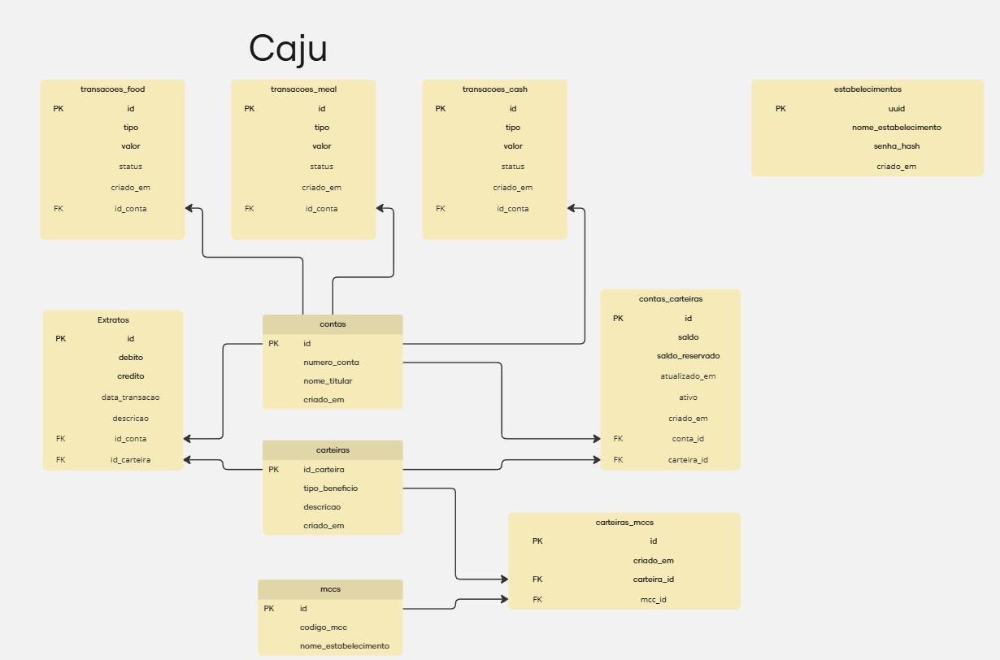

# Caju - Sistema de Processamento de Transações



## Visão Geral

Caju é uma API REST desenvolvida em Elixir com Phoenix Framework para processar transações financeiras em diferentes tipos de carteiras (alimentação, refeição e dinheiro). O sistema implementa um modelo de processamento de transações com validação de MCC (Merchant Category Code) para direcionar pagamentos para os tipos apropriados de carteira.

## Requisitos

- Docker e Docker Compose
- Git
- Preferencialmente WSL2 para usuários Windows

## Estrutura do Banco de Dados


### Principais Tabelas:

- **contas**: Armazena os dados das contas de usuários
- **carteiras**: Define tipos de carteira (food, meal, cash)
- **contas_carteiras**: Associa contas a carteiras com seus respectivos saldos
- **mccs**: Códigos MCC para classificação de estabelecimentos
- **transacoes**: Registro centralizado de todas as transações
- **estabelecimentos**: Dados dos estabelecimentos para autenticação

## Instalação e Execução

### Clonando o Repositório

```bash
git clone https://github.com/seu-usuario/caju.git
cd caju
```

### Configuração do Ambiente com Docker

O projeto utiliza Docker e Docker Compose para facilitar a configuração do ambiente de desenvolvimento.

1. Iniciar os contêineres:

```bash
docker-compose up -d
```

2. Aguardar a inicialização completa do sistema. A API estará pronta quando você visualizar no terminal:

```
web-1      | [info] Running CajuWeb.Endpoint with cowboy 2.12.0 at 0.0.0.0:4000 (http)
web-1      | [info] Access CajuWeb.Endpoint at http://localhost:4000
web-1      | [watch] build finished, watching for changes...
```

3. Acesse a API através de: http://localhost:4000

### Migrações e Seeds do Banco de Dados

Quando você executa o projeto com Docker Compose, as migrações e seeds são executados automaticamente durante a inicialização do container, através do script `docker-entrypoint.sh`. Isso significa que:

1. O banco de dados é criado automaticamente
2. As migrações são aplicadas automaticamente
3. Os dados iniciais (seeds) são carregados automaticamente

Se você precisar executar as migrações manualmente por algum motivo:

```bash
# Criar o banco de dados
docker-compose exec web mix ecto.create

# Executar migrações
docker-compose exec web mix ecto.migrate

# Carregar dados de teste (seeds)
docker-compose exec web mix run priv/repo/seeds.exs
```

Se precisar reiniciar o banco de dados do zero:

```bash
docker-compose exec web mix ecto.reset
```

### Acessando o Banco de Dados

Para acessar o banco de dados MySQL diretamente:

```bash
# Conecte ao container do MySQL
docker-compose exec db mysql -u caju -pcaju_password caju_dev

# Ou se preferir conectar via host
mysql -h 127.0.0.1 -P 3306 -u caju -pcaju_password caju_dev
```

## Documentação da API

### Swagger

A API está documentada com Swagger. Para acessar a documentação interativa:

1. Certifique-se que o servidor está rodando
2. Acesse: http://localhost:4000/api/swagger

### Rotas Principais

#### Autenticação

```
POST /auth/login?uuid=fa1b48ca-4eee-44db-9e6a-37cf4d58f1ea&senha=senha_secreta
```

Resposta de sucesso:
```json
{
  "token": "eyJhbGciOiJIUzUxMiIsInR5cCI6..."
}
```

#### Processamento de Transação

```
POST /api/efetivar/transacao
```

Cabeçalho:
```
Authorization: Bearer {token}
```

Corpo da requisição:
```json
{
  "conta": "123456",
  "valor": 100.00,
  "mcc": "5411",
  "estabelecimento": "Supermercado A"
}
```

Resposta de sucesso:
```json
{
  "code": "00"
}
```

Códigos de retorno:
- `00`: Transação aprovada
- `51`: Saldo insuficiente
- `07`: Erro geral (conta inexistente, etc.)

## Testando a API

### Usando o Swagger

1. Acesse http://localhost:4000/api/swagger
2. Autentique-se via rota `/auth/login`
3. Copie o token retornado
4. Utilize o token para autorizar as requisições na UI do Swagger
5. Teste a rota `/api/efetivar/transacao`

### Usando o Postman

Um arquivo Postman Collection está disponível na raiz do projeto (`caju.postman_collection.json`), contendo exemplos de todas as requisições.

1. Importe a coleção no Postman
2. Execute a requisição "Login" para obter o token
3. O token tem validade de 1 minuto (para fins de teste)
4. Use o token para autenticar as demais requisições

## Cenários de Teste Implementados

A coleção Postman inclui os seguintes cenários:

1. Transação com carteira Meal em estabelecimento de refeição (MCC 5811)
2. Transação com carteira Meal em estabelecimento de refeição alternativo (MCC 5812)
3. Transação com carteira Food em supermercado (MCC 5411)
4. Transação com carteira Food em supermercado alternativo (MCC 5412)
5. Transação usando Cash quando saldo de Meal não é suficiente
6. Transação com MCC não mapeado (usa carteira Cash)
7. Localização de estabelecimento por nome
8. Tentativa de transação com saldo insuficiente
9. Erro com conta inexistente

## Executando Testes Unitários

Para executar a suíte de testes do projeto, você precisa usar o ambiente de teste:

```bash
# Executar todos os testes
docker-compose exec -e MIX_ENV=test web mix test

# Executar um arquivo de teste específico
docker-compose exec -e MIX_ENV=test web mix test test/caju/services/contas_carteiras_service_test.exs
```

> **Observação**: É importante usar a flag `-e MIX_ENV=test` para garantir que os testes usem o ambiente correto com a configuração do Ecto.Adapters.SQL.Sandbox.

Para ver a cobertura de testes:

```bash
docker-compose exec -e MIX_ENV=test web mix coveralls
```

### Cobertura de Testes

A cobertura de testes pode ser visualizada em formato HTML executando o comando:

```bash
docker-compose exec -e MIX_ENV=test web mix coveralls.html
```

Isso gerará um relatório HTML na pasta `cover/` que pode ser aberto em um navegador para visualizar detalhadamente a cobertura de testes.


## Desenvolvimento

### Estrutura do Projeto

- `lib/caju/models`: Esquemas Ecto para as tabelas
- `lib/caju/repositories`: Acesso ao banco de dados
- `lib/caju/services`: Regras de negócio
- `lib/caju_web/controllers`: Controladores da API
- `test/`: Testes unitários e de integração

### Comandos Úteis

```bash
# Gerar documentação Swagger
docker-compose exec web mix phx.swagger.generate

# Acessar o shell interativo do Elixir
docker-compose exec web iex -S mix

# Verificar logs da aplicação
docker-compose logs -f web

# Reiniciar a aplicação
docker-compose restart web
```

## Tecnologias Utilizadas

- Elixir 1.14
- Phoenix Framework 1.7
- MySQL 5.7
- Docker & Docker Compose
- Guardian (Autenticação JWT)
- Phoenix Swagger
- ExCoveralls (Cobertura de testes)

## Resposta Desafio Técnico

### L4. Questão aberta

Para garantir que apenas uma transação por conta fosse processada em um determinado momento, em uma transação síncrona, poderia ser utilizado um sistema de reserva de saldo, no qual a transação chegaria e, no primeiro passo, faria a reserva do saldo com base no valor da transação. Em seguida, seriam realizadas todas as validações necessárias e, no momento do lançamento, o saldo reservado seria descontado do saldo real e retirado do saldo reservado, sempre validando se o saldo reservado é maior ou igual ao valor da transação no momento do lançamento. No desafio proposto, implementei essa estrutura e também adicionei as operações dentro de uma transaction do Ecto, para garantir que, caso ocorra algum erro, seja dado rollback em todas as operações, incluindo na reserva do saldo, no lançamento na tabela de transações e no extrato.